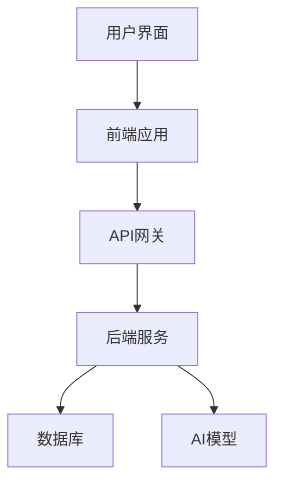

# Law Agent

<div align="center">


**法律智能助手系统**

基于AI技术的法律咨询平台，提供智能问答、文档处理和法律知识服务

[](LICENSE)
[](https://www.python.org/downloads/)
[](https://reactjs.org/)
[](https://fastapi.tiangolo.com/)

</div>

## 📋 目录

- [项目简介](#项目简介)
- [功能特性](#功能特性)
- [项目状态](#项目状态)
- [技术架构](#技术架构)
- [项目结构](#项目结构)
- [快速开始](#快速开始)
  - [环境要求](#环境要求)
  - [方法一：使用启动脚本（推荐）](#方法一使用启动脚本推荐)
  - [方法二：手动启动](#方法二手动启动)
- [访问地址](#访问地址)
- [开发指南](#开发指南)
  - [前端开发](#前端开发)
  - [后端开发](#后端开发)
- [贡献指南](#贡献指南)
- [许可证](#许可证)

## 项目简介

Law Agent 是一个基于FastAPI和React构建的法律智能助手系统，旨在通过人工智能技术，为用户提供便捷、准确的法律咨询服务。系统集成了先进的自然语言处理模型，能够理解用户法律问题并提供专业解答，同时支持法律文档处理和历史记录管理。

## 功能特性

### 🎯 核心功能

- **智能法律咨询**：基于AI的法律问题解答
- **多轮对话**：支持连续提问和深入探讨
- **历史记录管理**：保存和查看咨询历史

### 🚀 高级功能（开发中）

- **法律文档处理**：支持上传、解析和生成法律文档
- **法律知识库**：内置常见法律知识库
- **用户认证**：安全登录和身份验证
- **文档模板**：提供常用法律文档模板

## 项目状态

| 功能模块 | 状态 | 完成度 |
|---------|------|--------|
| 基础聊天功能 | ✅ 已完成 | 100% |
| 后端API | ✅ 已完成 | 100% |
| 用户认证系统 | 🔄 开发中 | 30% |
| 法律文档处理 | 🔄 开发中 | 20% |
| UI优化 | 🔄 开发中 | 40% |

## 技术架构

<div align="center">



</div>

- **前端**：React + TypeScript + Vite
- **后端**：FastAPI + Uvicorn + PyMongo
- **数据库**：MongoDB
- **AI模型**：OpenAI API (或其他法律专业模型)
- **状态管理**：React Context API
- **UI组件库**：Ant Design (待集成)
- **身份验证**：JWT (待实现)

## 项目结构

```
law-agent/
├── frontend/                    # 前端项目
│   ├── src/                    # 源代码目录
│   │   ├── components/         # 可复用UI组件
│   │   │   ├── Sidebar.tsx     # 侧边栏组件
│   │   │   ├── Header.tsx      # 页面头部
│   │   │   ├── InputArea.tsx   # 输入区域
│   │   │   ├── HistorySidebar.tsx  # 历史记录侧边栏
│   │   │   ├── FeatureCards.tsx    # 功能卡片组件
│   │   │   ├── ErrorBoundary.tsx    # 错误边界组件
│   │   │   └── ...             # 其他组件
│   │   ├── pages/              # 页面组件
│   │   │   ├── HomePage.tsx    # 首页
│   │   │   └── ChatPage.tsx    # 聊天页面
│   │   ├── hooks/              # 自定义Hook
│   │   │   └── useSendMessage.ts # 消息发送Hook
│   │   ├── services/           # API服务层
│   │   │   └── apiService.ts   # API调用逻辑
│   │   ├── App.tsx             # 主应用组件
│   │   ├── main.tsx            # 应用入口
│   │   └── router.tsx          # 路由配置
│   ├── public/                 # 静态资源
│   ├── index.html             # HTML入口文件
│   ├── package.json           # 项目依赖配置
│   ├── tsconfig.json          # TypeScript配置
│   └── vite.config.ts         # Vite构建配置
├── backend/                     # FastAPI + Uvicorn 后端项目
│   ├── main.py                 # FastAPI应用主入口
│   ├── database.py             # 数据库配置与连接
│   ├── models/                 # 数据模型
│   │   └── chat.py             # 聊天相关数据模型
│   ├── routers/                # API路由模块
│   │   ├── chat.py             # 聊天相关API
│   │   └── health.py           # 健康检查API
│   ├── services/               # 业务逻辑服务
│   │   └── chat_service.py     # 聊天服务逻辑
│   └── utils/                  # 工具函数
├── start.bat                   # 项目启动脚本
├── LICENSE                     # MIT许可证
├── requirements.txt            # Python依赖包列表
├── .env.example               # 环境变量示例
└── README.md                  # 项目说明文档
```

## 快速开始

### 环境要求
- Python 3.8+
- pip (Python包管理器)
- Node.js 16+
- npm (Node包管理器)
- 现代浏览器 (Chrome, Firefox, Edge等)

### 方法一：使用启动脚本（推荐）

1. 确保已安装 Python 3.8+ 和 Node.js 16+
2. 双击运行 `start.bat` 文件
3. 等待依赖安装完成，服务自动启动

### 方法二：手动启动

#### 后端启动

1. 进入后端目录：
   ```bash
   cd backend
   ```

2. 安装依赖：
   ```bash
   pip install -r requirements.txt
   ```

3. 启动服务（任选一种方式）：

   **方式1：使用run.py脚本**
   ```bash
   python run.py
   ```

   **方式2：直接使用uvicorn命令**
   ```bash
   uvicorn main:app --host 0.0.0.0 --port 8000 --reload
   ```

   **方式3：使用模块运行**
   ```bash
   uvicorn backend.main:app --host 0.0.0.0 --port 8000 --reload
   ```

#### 前端启动

1. 进入前端目录：
   ```bash
   cd frontend
   ```

2. 安装依赖：
   ```bash
   npm install
   ```

3. 启动开发服务器：
   ```bash
   npm run dev
   ```

## 访问地址

| 服务 | 地址 | 描述 |
|------|------|------|
| 前端页面 | http://localhost:3000 | 用户界面 |
| 后端API | http://localhost:8000 | API服务 |
| API文档 | http://localhost:8000/docs | Swagger API文档 |
| 健康检查 | http://localhost:8000/health | 服务健康状态 |

## 开发指南

### 前端开发

#### 目录结构

- `src/components/` - 可复用UI组件
- `src/pages/` - 页面组件
- `src/hooks/` - 自定义Hook
- `src/services/` - API服务层

#### 开发流程

1. 创建新组件或页面
2. 编写组件逻辑和样式
3. 使用自定义Hook处理业务逻辑
4. 通过API服务层与后端通信
5. 测试功能并提交代码

### 后端开发

#### 目录结构

- `main.py` - FastAPI应用主入口
- `models/` - 数据模型
- `routers/` - API路由模块
- `services/` - 业务逻辑服务

#### 开发流程

1. 定义数据模型
2. 实现业务逻辑
3. 创建API路由
4. 编写API文档
5. 测试API并提交代码

## 贡献指南

我们欢迎任何形式的贡献，包括但不限于：

- 提交bug报告
- 提出新功能建议
- 改进文档
- 提交代码修复
- 开发新功能

### 提交代码

1. Fork项目
2. 创建特性分支 (`git checkout -b feature/AmazingFeature`)
3. 提交更改 (`git commit -m 'Add some AmazingFeature'`)
4. 推送到分支 (`git push origin feature/AmazingFeature`)
5. 创建Pull Request

## 许可证

本项目采用 MIT 许可证 - 查看 [LICENSE](LICENSE) 文件了解详情。
